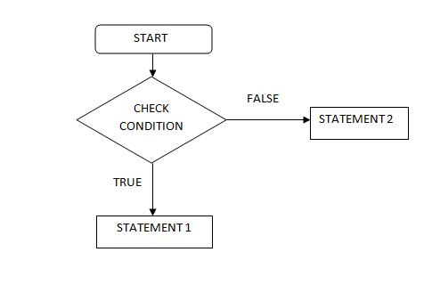
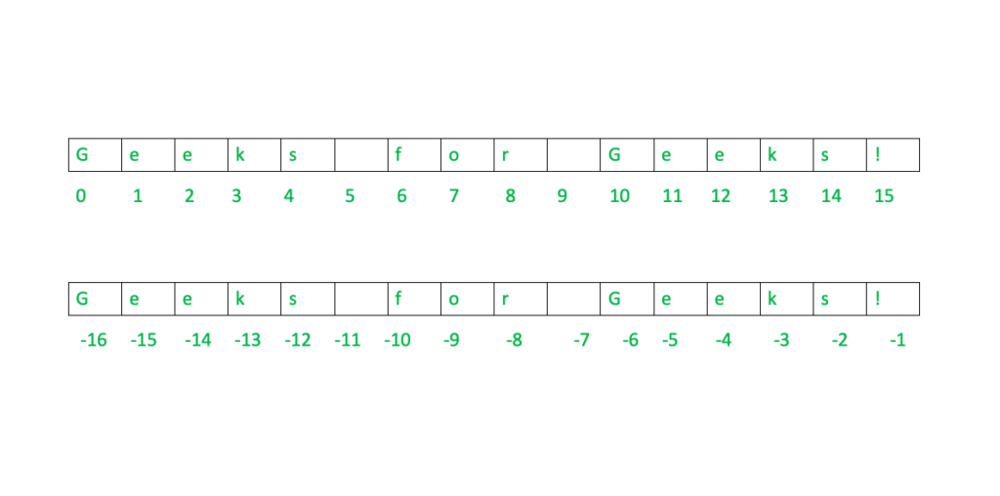
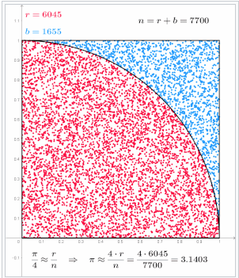

https://codingforkids.io/
# O meu primeiro programa
```python
In [1]: print("hello world")
hello world
```
# Python3
- Python é uma linguagem de programação de alto nível e de uso geral. 
- Suporta diferentes paradigmas:
	- Programação orientada a estruturas
	- Programação orientada a objetos
	- Programação funcional

## Em python tudo são objetos e operações
```python
In [2]: 3 + 10
Out[2]: 13
```

```python
In [3]: "hello " + "world"
Out[3]: 'hello world'
```

Nestes exemplos qualquer tipo de dados: números e strings são objetos.
Tudo o resto são operações.
# Operações
Qualquer operação da matemática é valida em python3.

| operação | descrição        |
| -------- | ---------------- |
| +        | soma             |
| -        | subtração        |
| *        | multiplicação    |
| /        | divisão          |
| //       | divisão inteira  |
| %        | resto da divisão |
| abs      | modulo           |
| **       | expoente         |
## Operações booleanas
| operação |
| -------- |
| and      |
| or       |
| not      |
| <        |
| < =      |
| ==       |
| ! =      |
Qualquer outro tipo de operação, como por exemplo a raiz quadrada, deve ser importada a biblioteca *math*.
# Instruções de Controlo
Imagina que tu só queres executar uma operação se determinada condição existir.



```python
altura = 1.69
altura_minima = 1.45
peso = 57
peso_máximo = 60
if alura > altura_minima:
	print("Pode andar no carrocel")
elif peso < peso_maximo:
	print("Pode andar no carrocel")
else:
	print("Não pode andar no carrocel")
```
# Variáveis
Supõe que queremos construir um programa para calcular o IMC (índice de massa corporal)
$$ IMC = \frac{peso}{altura \times altura}$$
```python
In [4]: 57 / ( 1.69 * 1.69 )
Out[4]: 19.95728440880922
```

Como podes ver, para o calculo do IMC usa duas vezes a variável $altura$.
Se fosse outro exemplo, escrever todas as variáveis de forma explicita pode tornar-se confuso.
Como podemos criar variáveis tal como na matemática que agilizem este processo?
```python
In [5]: peso = 57
In [6]: altura = 1.69
In [7]: imc = peso / (altura*altura)
In [9]: print(imc)
Out[5]: 19.95728440880922
```
# Strings
Strings são conjuntos de caracteres.
```python
In [10]: meu_adn = "ATTCCGTAGC"
In [11]: print(meu_adn)
ATTCCGTAGC
```
## Operadores
| operação | descrição                         |
| -------- | --------------------------------- |
| +        | Concatenação de duas strings      |
| *        | Concatenação de multiplas strings |
| len      | Dimensão da minha string          |
## Acesso à string

```python
In [12]: print(meu_adn[0])
A

In [13]: print(meu_adn[0] == meu_adn[-3])
True
```
## Strings são imutáveis
```python
In [16]: meu_adn[2] = "A"
---------------------------------------------------------------------------
TypeError                                 Traceback (most recent call last)
Cell In[16], line 1
----> 1 meu_adn[2] = "A"

TypeError: 'str' object does not support item assignment
```
## Fatiamento
```python
In [14]: print(meu_adn[3:6])
CCG
```
## Converter um número para string
```python
In [15]: print(str(9))
9
```
# Listas
Listas é uma forma ótima de guardar múltiplas variáveis numa só.
```python
mylist = ["apple", "banana", "cherry", 1, 2, 3]
```

| operação                 | descrição                                                                          |
| ------------------------ | ---------------------------------------------------------------------------------- |
| append(value)            | Adiciona um elemento no final da lista                                             |
| clear()                  | Remove todos os elementos da lista                                                 |
| copy()                   | Retorna uma cópia da lista                                                         |
| count(value)             | Retorna o número de elementos com o valor especificado                             |
| extend([value1, value2]) | Adiciona os elementos de uma lista (ou qualquer iterável), ao final da lista atual |
| index(value)             | Retorna o índice do primeiro elemento com o valor especificado                     |
| insert(index)            | Adiciona um elemento na posição especificada                                       |
| pop(index)               | Remove o elemento na posição especificada                                          |
| remove(value)            | Remove o item com o valor especificado                                             |
| reverse()                | Inverte a ordem da lista                                                           |
| sort()                   | Ordena os elementos da lista                                                       |
## Listas são mutáveis
```python
In [1]: mylist = ["apple", "banana", "cherry", 1, 2, 3]
In [2]: mylist[0] = "maca"
In [3]: print(mylist)
['maca', 'banana', 'cherry', 1, 2, 3]
```

# Problemas
## Método de Monte Carlo
Tenta aproximar o número de $\pi$.

A área do circulo é dada por $\pi \times r^2$.
Se $r=1 => A_o = \pi$. 
Se considerarmos apenas o primeiro quadrante do circulo a área será $\frac{\pi}{4}$.

Sendo assim, se gerarmos um número suficientemente grande de pontos aleatórios conseguimos estimar o valor de $\pi$.



```python
import random
import math

inside_circle = 0
number_generations = 100000000    # reduce the number of generation

for i in range(number_generations):
    # generate a point
    x = random.random()
    y = random.random()
    point = [x, y]

    # calculate the distance of the point to the origin
    distance = math.sqrt( x**2 + y**2 )

    # check if point is inside or outside the circle
    if distance < 1:
        inside_circle = inside_circle + 1

print(4 * inside_circle / number_generations)
```
## Concentração de um antibiótico no sangue
A concentração do antibiótico no sangue diminui para metade a cada dia que passa.
Cada comprimido aumenta a concentração em 0.33 unidades.

Qual é a concentração do antibiótico ao fim de 7 dias?

A concentração é dada por 
$$ C_{n+1} = 0.5 \times C_n + 0.33 $$

```python
cc = [0]
total_days = 7

for i in range(total_days):
    cc_today = cc[-1]*0.5 + 0.33
    cc.append(cc_today)

print("A concentração no dia", total_days, "é", cc[-1])
print(cc)
```

Se eu deixar de tomar ao 7 dia, quando é que a concentração chega a 0?

```python
cc = [0]
total_days = 7
total_time = 30

for time in range(total_time):
    if time < total_days:
        cc_today = cc[-1]*0.5 + 0.33
    else:
        cc_today = cc[-1]*0.5

    if cc_today < 0.000001:
        cc.append(cc_today)
        print("No dia", time, "a concentração chegou a zero")
        break
        
    cc.append(cc_today)
```
## Estudo da composição sala
```python
students = ["rapaz", "rapariga", "rapariga", "rapariga", "rapaz", "rapariga", "rapaz", "rapariga", "rapaz"]

# total students?
total = len(students)
print("O total de alunos é:", total)

# percentage of girls
girls_count = 0
for i in range(total):
    if students[i] == "rapariga":
        girls_count = girls_count + 1

print("O total de raparigas é:", girls_count)
print("Percentagem de raparigas é:", girls_count / total)


# percentage of boys
boys_count = 0
for i in range(total):
    if students[i] == "rapaz":
        boys_count = boys_count + 1

print("O total de rapazes é:", boys_count)
print("Percentagem de rapazes é:", boys_count / total)


# the percentage of girls is between 0.4 and 0.6?
p_g = girls_count / total
if 0.4 <= p_g <= 0.6:
    print("A percentagem de raparigas pertence ao intervalo [0.4 , 0.6]")
else:
    print("A percentagem de raparigas nao pertence ao intervalo [0.4 , 0.6]")
```